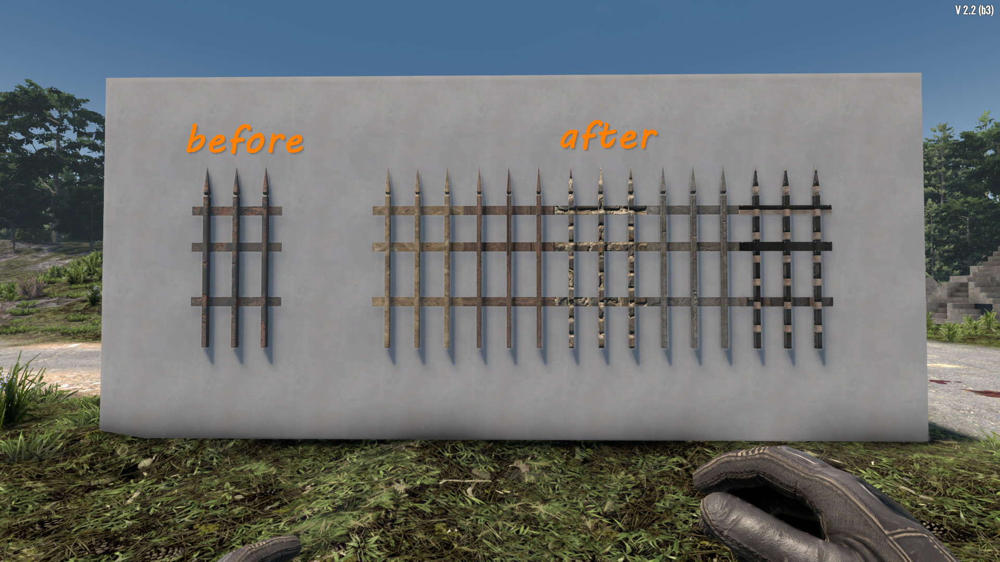
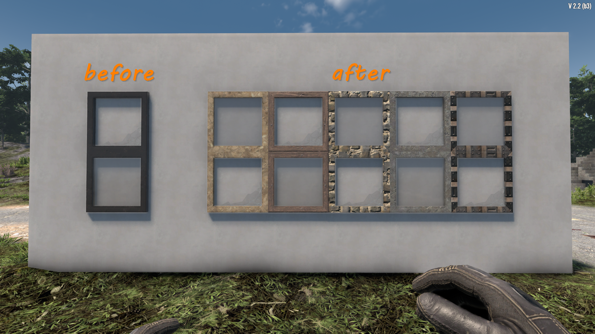

# ISI Textureless

Removes default textures from industrial fences (and other shapes) so you can tell if it has been upgraded or not.

## Screenshots

## Testing

1. Place industrial fences and verify textures are removed
2. Upgrade fences and confirm texture changes with each upgrade (wood, cobblestone, concrete, steel)

